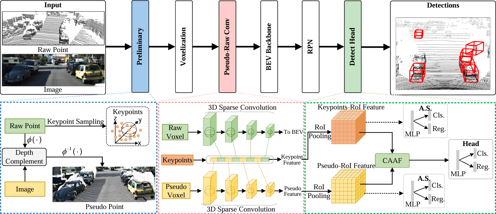

# [ICASSP2025] FGU3R: Fine-Grained Fusion via Unified 3D Representation for Multimodal 3D Object Detection
This is the official repository of [FGU3R](https://arxiv.org/abs/2501.04373).



## Abstract
Multimodal 3D object detection has garnered considerable interest in autonomous driving. However, multimodal detectors suffer from dimension mismatches that derive from fusing 3D points with 2D pixels coarsely, which leads to suboptimal fusion performance. In this paper, we propose a multimodal framework FGU3R to tackle the issue mentioned above via unified 3D representation and fine-grained fusion, which consists of two important components. First, we propose an efficient feature extractor for raw and pseudo points, termed Pseudo-Raw Convolution (PRConv), which modulates multimodal features synchronously and aggregates the features from different types of points on key points based on multimodal interaction. Second, a Cross-Attention Adaptive Fusion (CAAF) is designed to fuse homogeneous 3D RoI (Region of Interest) features adaptively via a cross-attention variant in a fine-grained manner. Together they make fine-grained fusion on unified 3D representation. The experiments conducted on the KITTI and nuScenes show the effectiveness of our proposed method.

## Installation
### Requirements
All the codes are tested in the following environment:
* Linux (tested on Ubuntu 18.04)
* NVIDIA RTX 3090 GPU
* CUDA 11.1 (recommended)
* pytorch 1.8+cu111 
* spconv+cu111 

### Install FGU3R
a. Clone the FGU3R repository.
```shell
git clone --recursive https://github.com/Raiden-cn/FGU3R
```

b. Install the main dependent python libraries like `pytorch`,[`spconv v2.x`](https://github.com/traveller59/spconv), `tensorboardX` etc.
please make sure you already install cuda 11.1 (only test on it)

```shell
pip install torch==1.8.1+cu111 torchvision==0.9.1+cu111 torchaudio==0.8.1 -f https://download.pytorch.org/whl/torch_stable.html
pip install spconv-cu111
pip install -r requirements.txt
```

c. Install this `fgu3r` library and its dependent libraries by running the following command:
```shell
cd FGU3R
python setup.py develop
```

## Dataset preparation
Please download the official [KITTI 3D object detection](http://www.cvlibs.net/datasets/kitti/eval_object.php?obj_benchmark=3d) dataset and organize the downloaded files as follows: 

```shell
FGU3R
├── data
│   ├── kitti
│   │   ├── ImageSets
│   │   ├── training
│   │   │   ├──calib
│   │   │   ├──velodyne
│   │   │   ├──label_2
│   │   │   ├──image_2
│   │   │   ├──pseudo_velodyne
│   │   │   ├──planes (optional)
│   │   ├── testing
│   │   │   ├──calib
│   │   │   ├──velodyne
│   │   │   ├──image_2
│   │   │   ├──pseudo_velodyne
├── fgu3r
├── tools
```

NOTE: **pseudo_velodyne** in training and testing can be download here: baiduwp link TODO

Execute the following command to generating `.pkl` and `gt_database` for training and testing:

```shell
cd FGU3R
python -m fgu3r.datasets.kitti.kitti_dataset create_kitti_infos tools/cfgs/dataset_configs/kitti_dataset.yaml
```

After this, the `.pkl` and `gt_database` will generated as following:

```shell
FGU3R
├── data
│   ├── kitti
│   │   ├── ImageSets
│   │   ├── gt_database
│   │   ├── gt_database_pseudo
│   │   ├── training
│   │   │   ├──calib
│   │   │   ├──velodyne
│   │   │   ├──label_2
│   │   │   ├──image_2
│   │   │   ├──pseudo_velodyne
│   │   │   ├──planes
│   │   ├── testing
│   │   │   ├──calib
│   │   │   ├──velodyne
│   │   │   ├──image_2
│   │   │   ├──pseudo_velodyne
│   │   ├── kitti_dbinfos_train.pkl
│   │   ├── kitti_infos_test.pkl
│   │   ├── kitti_infos_train.pkl
│   │   ├── kitti_infos_trainval.pkl
│   │   ├── kitti_infos_val.pkl
├── fgu3r
├── tools
```

## Results

### KITTI val car
|              Detector                   | GPU (train)| Easy | Mod. | Hard|
|---------------------------------------------|:----------:|:-------:|:-------:|:-------:|
| [FGU3R](./tools/cfgs/kitti_models/fgu3r.yaml) | ~16 GB | 95.26 | 85.84 | 83.67 |
****

## Training
```shell
cd tools
# single gpu
python train.py --cfg_file cfgs/kitti_models/fgu3r.yaml --extra_tag baseline
# multi gpus
CUDA_VISIBLE_DEVICES=0,1,2,3,4,5,6,7 ./scripts/dist_train.sh 8 --cfg_file cfgs/kitti_models/fgu3r.yaml --extra_tag baseline
```

## Testing
```shell
cd tools
# single gpu
python test.py --cfg_file cfgs/kitti_models/fgu3r.yaml --extra_tag baseline --ckpt ../ckpt/fgu3r.pth
# multi gpus
CUDA_VISIBLE_DEVICES=0,1,2,3,4,5,6,7 ./scripts/dist_test.sh 8 --cfg_file cfgs/kitti_models/fgu3r.yaml --extra_tag baseline --ckpt ../ckpt/fgu3r.pth
```

## TODO
 - [ ] Release pseudo point cloud link
 - [ ] Developing FGU3R++

## Acknowledgement
Our code mainly based on [OpenPCDet](https://github.com/open-mmlab/OpenPCDet) by Shaoshuai Shi. Part code from following excellent repos: [SFD](https://github.com/LittlePey/SFD), [TED](https://github.com/hailanyi/TED), [SE-SSD](https://github.com/Vegeta2020/SE-SSD).

Thanks for above great repos and the reviewers's valuable comments on our paper.

## Citation
If you find this work useful in your research, please consider cite:

```
@INPROCEEDINGS{fgu3r,
  author={Zhang, Guoxin and Song, Ziying and Liu, Lin and Ou, Zhonghong},
  booktitle={ICASSP 2025 - 2025 IEEE International Conference on Acoustics, Speech and Signal Processing (ICASSP)}, 
  title={FGU3R: Fine-Grained Fusion via Unified 3D Representation for Multimodal 3D Object Detection}, 
  year={2025},
  pages={1-5},
  keywords={Point cloud compression;Three-dimensional displays;Fuses;Convolution;Aggregates;Object detection;Detectors;Feature extraction;Speech processing;Autonomous vehicles;3D object detection;multimodal;cross attention},
  doi={10.1109/ICASSP49660.2025.10889148}}
```